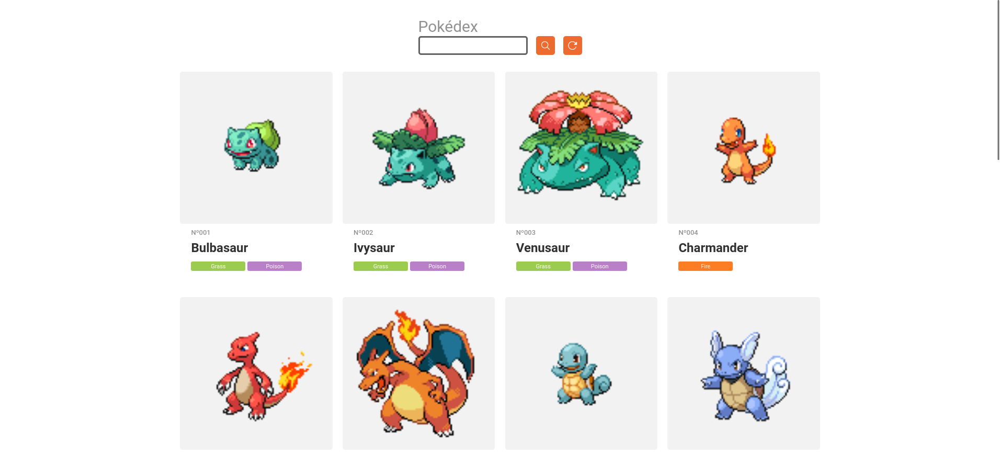

# Pokedex

    
    
    
    
    
    

> Pokedex using the https://pokeapi.co api

## 🚀 How to use the project

### 🛹 Clone the repo

`git clone https://github.com/andreseichi/pokedex.git`

or

`git@github.com:andreseichi/discord-clone-react.git`

### 📒 Access the repo

`cd pokedex`

### 🧭 Install all dependencies with yarn

`yarn install`

### 🔨 Build it

`yarn build`
